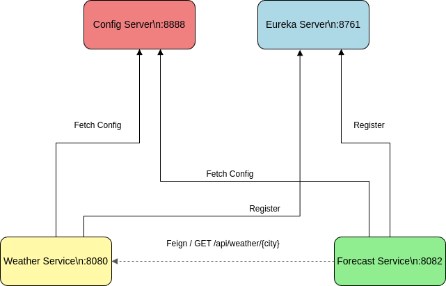

# Spring Cloud Weather

A small Spring Cloud microservices system that demonstrates centralized configuration, service discovery, and inter-service communication for a toy weather domain.

It consists of four modules plus a git-backed configuration repository:

- config-server: Spring Cloud Config Server (port 8888)
- eureka-server: Netflix Eureka service registry (port 8761)
- weather-service: Simple REST API that returns current weather data (port 8080)
- forecast-service: Service scaffold prepared to call weather-service via OpenFeign and Eureka (port 8082)
- config-repo/: Git-backed config files loaded by the Config Server for each service

## Architecture




## Service ports and identities

- Config Server: 8888, app name `Config Server`
- Eureka Server: 8761, app name `eureka-server`
- Weather Service: 8080, app name `weather-service` (exports REST API)
- Forecast Service: 8082, app name `forecast-service` (uses OpenFeign client `weather-service`)

All services import configuration from the Config Server at `http://localhost:8888`.


## Configuration sources

The Config Server loads YAML from the `config-repo/` directory in this repository via a git backend:

- `config-repo/eureka-server.yml` — sets `server.port=8761` and disables self-registration
- `config-repo/weather-service.yml` — sets `server.port=8080` and points Eureka client to `http://localhost:8761/eureka/`
- `config-repo/forecast-service.yml` — sets `server.port=8082` and points Eureka client to `http://localhost:8761/eureka/`

The Config Server is configured in `config-server/src/main/resources/application.yaml` to use:

```
spring.cloud.config.server.git.uri=https://github.com/ch88251/spring-cloud-weather
spring.cloud.config.server.git.search-paths=config-repo
```

Tip: If you prefer to use a local path instead of cloning from GitHub, you can override at runtime:

- Use a file URI: `--spring.cloud.config.server.git.uri=file:///absolute/path/to/spring-cloud-weather`
- Or switch to the native backend: `--spring.profiles.active=native --spring.cloud.config.server.native.searchLocations=file:///absolute/path/to/spring-cloud-weather/config-repo`

## How to run (order matters)

Open four terminals, one per module. Start them in this order so downstream services can fetch config and register.

1) Start Config Server

```bash
cd config-server
./gradlew bootRun
```

Wait until you see: `Tomcat started on port(s): 8888`.

2) Start Eureka Server

```bash
cd eureka-server
./gradlew bootRun
```

- UI: http://localhost:8761/
- Wait until you see it register as available.

3) Start Weather Service

```bash
cd weather-service
./gradlew bootRun
```

- Health: http://localhost:8080/actuator/health
- API example:

```bash
curl http://localhost:8080/api/weather/London
```

Sample response:

```json
{"city":"London","temperature":22,"condition":"Sunny"}
```

4) Start Forecast Service

```bash
cd forecast-service
./gradlew bootRun
```

- Registers with Eureka as `forecast-service` (port 8082)
- Uses an OpenFeign client targeting the Eureka service id `weather-service`
- Note: The provided `ForecastController` is currently a scaffold without an external endpoint. Add your own controller method to call the `WeatherClient` if you want to expose forecast endpoints.

## Building runnable JARs (optional)

You can also build executable jars for each service:

```bash
cd config-server && ./gradlew bootJar
cd ../eureka-server && ./gradlew bootJar
cd ../weather-service && ./gradlew bootJar
cd ../forecast-service && ./gradlew bootJar
```

Run them with:

```bash
java -jar build/libs/*-SNAPSHOT.jar
```